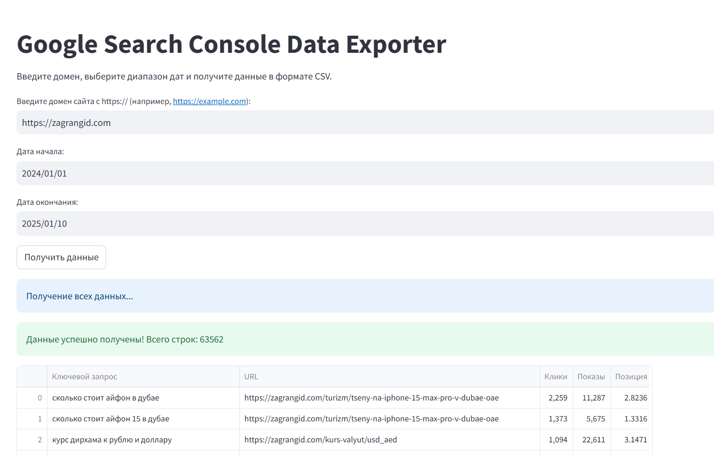

# Google Search Console Data Exporter

**Google Search Console Data Exporter** — это приложение, созданное с использованием **Streamlit**, для удобной выгрузки данных из Google Search Console в формате CSV. Оно позволяет получить информацию о ключевых запросах, связанных URL, количестве кликов, показах и средней позиции для указанного домена и диапазона дат.

Скрипт был создан для Telegram-канала [ChatGPT, AI, Python для SEO](https://t.me/python_seo).


## Функциональные возможности

- **Удобный интерфейс**:
  - Ввод домена сайта (например, `https://example.com`).
  - Выбор диапазона дат с помощью интерактивного календаря.
  - Кнопка для запуска процесса получения данных.

- **Полная информация о запросах**:
  - Ключевые запросы (keywords).
  - URL страниц, на которых были найдены запросы.
  - Количество кликов по запросу.
  - Количество показов.
  - Средняя позиция в поисковой выдаче.

- **Прогресс выполнения**:
  - Отображение прогресс-бара для мониторинга выполнения запросов.

- **Отображение данных**:
  - Таблица с результатами выводится в интерфейсе Streamlit, что позволяет анализировать данные даже в случае ошибок.

- **Экспорт в CSV**:
  - Возможность скачать результат в формате CSV для последующей обработки.

## Как установить и запустить

### 1. Установите зависимости
Убедитесь, что Python установлен на вашем компьютере. Затем установите необходимые библиотеки:

```bash
pip install streamlit pandas google-auth google-auth-oauthlib google-auth-httplib2 google-api-python-client

